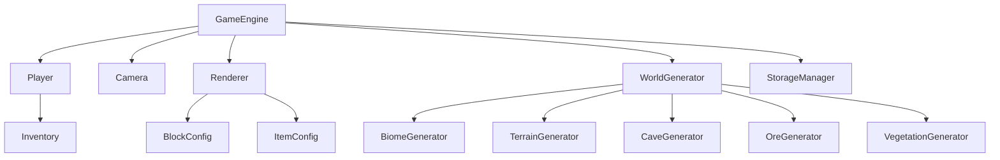

# Minecraft2D 迭代开发计划

## 1. 概述

Minecraft2D 是一个基于 React 和 Vite 构建的 2D Minecraft 风格沙盒游戏。本迭代开发计划旨在为项目提供清晰的开发路线图，确保功能实现的有序性和可维护性。该计划参考了 Minecraft Java 版的核心功能特性（除了末地和地狱维度之外的所有功能），以确保 2D 版本能够提供类似的丰富游戏体验。

## 2. 项目架构概览

## 3. 核心模块迭代计划

### 3.1 游戏引擎模块 (GameEngine)

#### 当前状态
- 已实现基础游戏循环
- 已集成时间系统
- 已支持永久白日模式

#### 迭代目标
1. 优化帧率控制机制
2. 完善子系统注册和管理
3. 增强性能监控和统计
4. 实现游戏难度系统
5. 添加游戏模式支持（生存/创造）

#### 迭代步骤
- [ ] 实现动态帧率调整功能
- [ ] 添加子系统健康检查机制
- [ ] 完善游戏状态管理
- [ ] 实现游戏难度设置（和平、简单、普通、困难）
- [ ] 添加游戏模式切换功能

### 3.2 玩家系统模块 (Player)

#### 当前状态
- 已实现基础移动和物理模拟
- 已支持飞行模式和速度调节
- 已集成生命值系统和摔伤机制
- 已实现物品栏系统

#### 迭代目标
1. 增强玩家交互能力
2. 完善物品使用机制
3. 优化物理模拟精度
4. 实现完整的生存机制（饥饿值、经验值等）
5. 添加玩家状态效果系统

#### 迭代步骤
- [ ] 实现方块放置和破坏功能
- [ ] 添加工具耐久度系统
- [ ] 优化水中移动和浮力计算
- [ ] 实现饥饿值系统和食物机制
- [ ] 添加经验值和等级系统
- [ ] 实现状态效果（速度、跳跃提升、中毒等）

### 3.3 世界生成模块 (WorldGenerator)

#### 当前状态
- 已实现程序化地形生成
- 已支持生物群系、洞穴、矿物和植被生成
- 已集成多种生成器

#### 迭代目标
1. 提升生成算法性能
2. 增加更多生物群系类型
3. 优化生成管线配置
4. 实现村庄和结构生成
5. 添加更多世界特性（废弃矿井、地牢等）

#### 迭代步骤
- [ ] 实现区块缓存优化机制
- [ ] 添加新的生物群系类型
- [ ] 完善生成参数配置面板
- [ ] 实现村庄生成系统
- [ ] 添加结构生成（地牢、废弃矿井等）
- [ ] 实现更丰富的地形特征

### 3.4 渲染系统模块 (Renderer)

#### 当前状态
- 已实现基础地形和玩家渲染
- 已支持天空、云朵和环境效果
- 已集成摄像机视图变换

#### 迭代目标
1. 增强视觉效果表现
2. 优化渲染性能
3. 完善UI渲染系统
4. 实现光照和阴影效果
5. 添加粒子系统

#### 迭代步骤
- [ ] 实现动态光照系统
- [ ] 添加粒子效果系统
- [ ] 优化区块渲染距离控制
- [ ] 实现光照和阴影计算
- [ ] 添加天气效果（雨、雪、雷暴）
- [ ] 实现生物渲染和动画

### 3.5 配置与存储模块

#### 当前状态
- 已实现游戏配置管理系统
- 已支持配置持久化存储
- 已集成配置面板UI

#### 迭代目标
1. 完善配置版本管理
2. 增强数据迁移能力
3. 优化存储性能
4. 实现世界存档管理
5. 添加数据备份和恢复功能

#### 迭代步骤
- [ ] 实现配置版本兼容机制
- [ ] 添加配置导入导出功能
- [ ] 完善异常处理和数据校验
- [ ] 实现多世界存档管理
- [ ] 添加自动保存和手动保存功能

## 4. 功能特性迭代计划

### 4.1 核心玩法增强

#### 当前状态
- 已实现基础移动、跳跃和飞行
- 已支持物品栏管理和基础交互

#### 迭代目标
1. 实现完整的方块交互系统
2. 增加更多工具和物品类型
3. 完善生存机制
4. 实现合成和熔炼系统
5. 添加红石系统（简化版）

#### 迭代步骤
- [ ] 实现方块挖掘和放置功能
- [ ] 添加工具耐久度和材质等级
- [ ] 完善饥饿值和生命值系统
- [ ] 实现工作台和合成系统
- [ ] 添加熔炉和熔炼机制
- [ ] 实现简化版红石电路

### 4.2 生物系统

#### 当前状态
- 已实现基础实体管理

#### 迭代目标
1. 实现敌对生物系统
2. 添加被动生物系统
3. 实现生物AI和行为
4. 添加生物生成和繁殖机制

#### 迭代步骤
- [ ] 实现僵尸等敌对生物
- [ ] 添加牛、猪等被动生物
- [ ] 实现生物AI（寻路、攻击等）
- [ ] 添加生物生成机制
- [ ] 实现生物繁殖系统

### 4.3 UI/UX 优化

#### 当前状态
- 已实现基础配置面板和调试控制台
- 已支持物品栏UI和快捷键操作

#### 迭代目标
1. 完善UI组件系统
2. 增强用户交互体验
3. 实现主题和个性化定制
4. 添加游戏内GUI系统
5. 实现聊天系统

#### 迭代步骤
- [ ] 实现统一的UI组件库
- [ ] 添加界面元素显示控制
- [ ] 完善响应式设计适配
- [ ] 实现背包、工作台等GUI界面
- [ ] 添加游戏内聊天系统
- [ ] 实现状态栏和HUD显示

### 4.4 音效和音乐系统

#### 当前状态
- 尚未实现音效系统

#### 迭代目标
1. 实现环境音效
2. 添加交互音效
3. 实现背景音乐系统

#### 迭代步骤
- [ ] 添加方块交互音效
- [ ] 实现环境音效（风声、水流等）
- [ ] 添加背景音乐播放系统
- [ ] 实现音量控制和音效开关

### 4.5 多人游戏系统

#### 当前状态
- 尚未实现多人游戏功能

#### 迭代目标
1. 实现基础多人游戏支持
2. 添加服务器连接功能
3. 实现玩家间交互

#### 迭代步骤
- [ ] 实现本地多人游戏
- [ ] 添加网络连接框架
- [ ] 实现玩家同步机制
- [ ] 添加聊天和交互功能

### 4.6 性能优化

#### 当前状态
- 已实现基础性能监控
- 已支持区块缓存机制

#### 迭代目标
1. 提升渲染性能
2. 优化内存使用
3. 增强加载速度
4. 实现性能分析工具

#### 迭代步骤
- [ ] 实现渲染批处理优化
- [ ] 添加内存泄漏检测机制
- [ ] 优化资源加载策略
- [ ] 实现性能监控面板
- [ ] 添加帧率优化机制

## 5. 测试与质量保证

### 5.1 单元测试
- [ ] 为核心模块编写单元测试
- [ ] 实现测试覆盖率监控
- [ ] 集成持续集成测试流程

### 5.2 集成测试
- [ ] 验证各模块间交互正确性
- [ ] 测试完整游戏流程
- [ ] 实现自动化回归测试

### 5.3 性能测试
- [ ] 建立性能基准测试
- [ ] 监控关键性能指标
- [ ] 优化性能瓶颈

### 5.4 功能测试
- [ ] 验证所有Minecraft Java版核心功能
- [ ] 测试游戏平衡性
- [ ] 验证用户体验一致性

## 6. 文档与知识管理

### 6.1 技术文档
- [ ] 完善各模块API文档
- [ ] 编写架构设计文档
- [ ] 更新开发指南

### 6.2 用户文档
- [ ] 编写用户操作手册
- [ ] 制作快速入门指南
- [ ] 提供配置说明文档

### 6.3 功能对照文档
- [ ] 制作与Minecraft Java版功能对照表
- [ ] 记录已实现和待实现功能
- [ ] 提供功能优先级说明

## 7. 发布与部署

### 7.1 版本管理
- [ ] 制定版本发布计划
- [ ] 实现版本控制策略
- [ ] 管理版本兼容性

### 7.2 部署流程
- [ ] 完善构建和打包流程
- [ ] 实现自动化部署
- [ ] 配置生产环境

## 8. 风险管理

### 8.1 技术风险
- 浏览器兼容性问题
- 性能瓶颈
- 内存泄漏风险
- 2D化复杂功能的挑战

### 8.2 进度风险
- 功能实现复杂度超出预期
- 测试发现问题需要重构
- 第三方依赖问题

### 8.3 应对策略
- 定期进行技术评审
- 建立代码审查机制
- 制定应急处理预案
- 优先实现核心功能